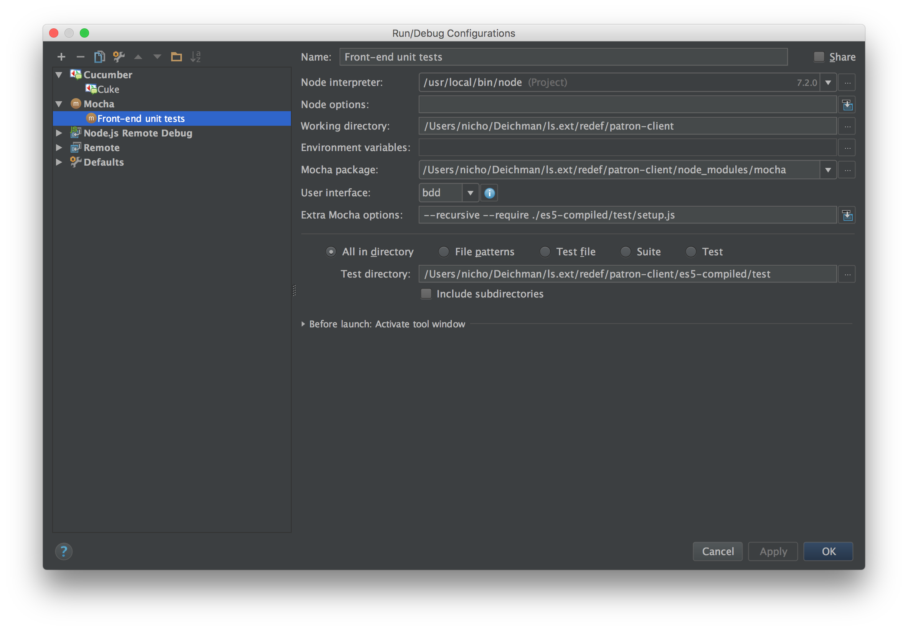

#Development process title

##Basic set-up

###Tools

- [git up (pyGitUp)](https://github.com/msiemens/PyGitUp)
- [git flow (avh-edition)](https://github.com/petervanderdoes/gitflow-avh)

###Requirements
- Docker
- Docker-compose (Mac, use homebrew)
- Git

###Steps

- clone [ls.ext](https://github.com/digibib/ls.ext)
- Run ```make provision```
- Run ```make test_one```

##Patron Client development
###Setting up IntelliJ
The project uses a strict set of linting rules that may also choke on some formatting. To ensure a common style, formatting should be performed based on a [standard config](files/Standard.xml).

To install:

1. Go to Preferences > Editor > Code Style > JavaScript
2. Click Manage next to Scheme.
3. Choose Import and select Standard.xml
4. Ensure that Standard is chosen as scheme.

The editor will give a code hint anywhere where semicolons are omitted. To fix this, click on the marking and press Alt+Enter, then disable the inspection from the meny that is displayed.

By default, IntelliJ will not use the correct language standard for Patron Client. The easiest way to switch is to open any .js file in e.g. redef/patron-client/src/components, then press to switch to JSX Harmony when the editor asks.


##Patron Client non-Docker development

Patron Client can de developed without any local dependencies, but it is not efficient.

1. Restarting node with changes requires running ```make rebuild_patron_client```.
2. File watching (required for Hot Module Reloading (HMR)) has proven problematic for mounted volumes.

###Requirements

- node.js
- compass (Ruby gem)

###Instructions
####Essential npm scripts

- verify: Run tests and linting.
- lint: Run linting.
- start: Starts the project, but KOHA\_API\_USER and KOHA\_API\_PASS must be provided.
- test:watch: Start tests and watch for code changes. Will re-run tests on code changes.
- es5: Compile all js to es5, useful for debugging unit tests in IntelliJ. See the Debugging tests section for more information.
- dev: Convenience script, run npm start with port 8001 and with KOHA\_API\_USER + KOHA\_API\_PASS
- devnode: Same as above, except it only runs node without compass. Useful when a lot of node restarts are required and no style changes are performed.
- killcompass: Will print an error, but will kill stale compass instances (might sometimes happen on ctrl+c'ing from start or dev)
- prodbuild: Build Patron Client for production
- production: Run Patron Client in production mode. Must have been built for production previously.

####Getting started with development outside Docker
1. Be ready for ls.ext development.
2. Install node.js.
3. Install compass. Ruby is required.
4. cd to Patron Client directory
5. Run ```npm install```.
6. Ensure that the machine's host file has the hosts properly set. Add this line to /etc/hosts or /private/etc/hosts depending on OS: ```127.0.0.1 services xkoha koha elasticsearch patron_client koha_mysql```.
7. You are now ready to run the npm scripts. ```npm run dev``` is usually a good start.

####Debugging unit tests

Since the unit tests are written with import syntax not available in node.js, transpiling is required. IntelliJ is then set to run the tests from the transpiled (ES5) code, but thanks to source maps any breakpoint in the original code will hit.

1. Run ```npm run es5``` to start transpiling. This is a watcher and will update any changed files.
2. In IntelliJ, press Run->Edit Configurations.
3. Press the + sign and choose Mocha.
4. In the settings for the Mocha config, change the lines according to the following screenshot: 


5. The configuration can be run via Run -> Debug.